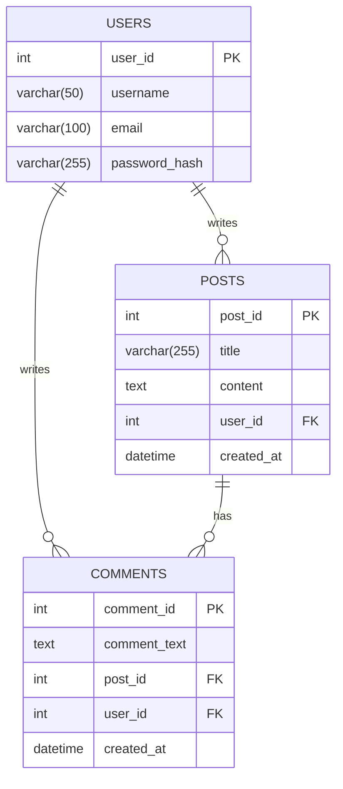
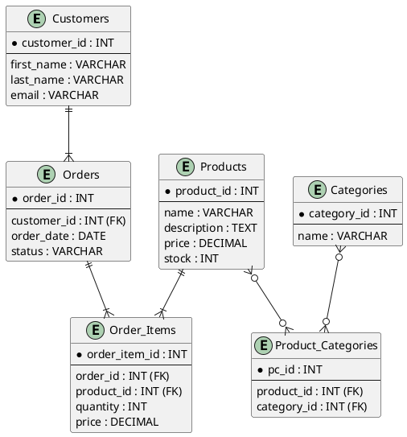

# Database Schema Design

## Overview
This skill is designed to assist in the creation, design, and documentation of database schemas. It provides a structured workflow for defining entities, attributes, relationships, and constraints, culminating in the generation of Entity-Relationship (ER) diagrams. This skill is ideal for database administrators, software developers, and system architects who need to create new databases or document existing ones.

## Automatic Triggers

**ALWAYS activate this skill when user mentions:**
- Keywords: database schema, ER diagram, entity-relationship, SQL schema, database design, database modeling, data modeling, database structure, modelagem de dados, esquema de banco de dados, diagrama ER, criar banco de dados, projetar banco de dados.
- Phrases: "design a database schema", "create an ER diagram", "document my database", "modelar um banco de dados", "preciso de um esquema de banco de dados", "gerar diagrama de entidade-relacionamento".
- Context: Any discussion about designing, creating, or documenting the structure of a database.

**Example user queries that trigger this skill:**
- "I need to design a database for my new e-commerce website."
- "Can you help me create an ER diagram for my project?"
- "Preciso documentar o esquema do nosso banco de dados legado."
- "Como eu faço a modelagem de dados para um sistema de blog?"

## When to Use This Skill
**ALWAYS use this skill when user mentions:**
- Designing a new database schema from scratch.
- Documenting an existing database structure.
- Generating Entity-Relationship (ER) diagrams.
- Creating or modifying SQL schema files.
- Discussing data modeling and database design concepts.
- Migrating a database and needing to understand the schema.

## Core Capabilities

### 1. Entity and Attribute Definition
- **Identify Entities:** Define the main objects or concepts to be stored in the database (e.g., Users, Products, Orders).
- **Define Attributes:** Specify the properties of each entity, including data types, constraints (e.g., NOT NULL, UNIQUE), and default values.

### 2. Relationship Modeling
- **Establish Relationships:** Define the connections between entities, including one-to-one, one-to-many, and many-to-many relationships.
- **Specify Cardinality and Ordinality:** Clearly define the number of instances of one entity that can be associated with instances of another entity.

### 3. Normalization
- **Apply Normal Forms:** Guide the user through the process of organizing the columns and tables of a database to minimize data redundancy.
- **1NF (First Normal Form):** Ensure that the domain of each attribute contains only atomic values, and the value of each attribute contains only a single value from that domain.
- **2NF (Second Normal Form):** Ensure that the table is in 1NF and all non-key attributes are fully functional dependent on the primary key.
- **3NF (Third Normal Form):** Ensure that the table is in 2NF and all its attributes are not transitively dependent on the primary key.

### 4. ER Diagram Generation
- **Visualize Schema:** Generate ER diagrams in various formats (e.g., PlantUML, Mermaid.js) to provide a visual representation of the database schema.
- **Customization:** Allow for customization of the generated diagrams to improve clarity and readability.

## Step-by-Step Workflow

1.  **Gather Requirements:**
    *   Start by understanding the data requirements of the application. What information needs to be stored? What are the relationships between different pieces of information?
    *   Use the `file` tool to create a new Markdown file (e.g., `requirements.md`) to document these requirements.

2.  **Identify Entities and Attributes:**
    *   Based on the requirements, identify the main entities (tables) for your database.
    *   For each entity, list its attributes (columns) and their data types.
    *   Example:
        ```markdown
        **Entity: Users**
        - user_id (INT, PRIMARY KEY, AUTO_INCREMENT)
        - username (VARCHAR(50), NOT NULL, UNIQUE)
        - email (VARCHAR(100), NOT NULL, UNIQUE)
        - created_at (TIMESTAMP, DEFAULT CURRENT_TIMESTAMP)
        ```

3.  **Define Relationships:**
    *   Determine the relationships between the entities (one-to-one, one-to-many, many-to-many).
    *   For many-to-many relationships, you will need a junction table.
    *   Example:
        ```markdown
        **Relationship: Users and Orders (One-to-Many)**
        - An order belongs to one user.
        - A user can have many orders.

        **Relationship: Products and Orders (Many-to-Many)**
        - An order can contain many products.
        - A product can be in many orders.
        - **Junction Table: Order_Items**
            - order_item_id (INT, PRIMARY KEY, AUTO_INCREMENT)
            - order_id (INT, FOREIGN KEY to Orders.order_id)
            - product_id (INT, FOREIGN KEY to Products.product_id)
            - quantity (INT, NOT NULL)
        ```

4.  **Apply Normalization:**
    *   Review your schema design and apply normalization rules (1NF, 2NF, 3NF) to reduce data redundancy and improve data integrity.

5.  **Generate ER Diagram:**
    *   Use a tool like PlantUML or Mermaid.js to create an ER diagram from your schema definition.
    *   This provides a visual representation of your database structure.
    *   You can use the `file` tool to write the diagram definition to a `.puml` or `.mmd` file and then use a rendering tool to generate the image.

6.  **Create SQL Schema:**
    *   Write the SQL `CREATE TABLE` statements based on your design.
    *   Save this as a `.sql` file.

7.  **Document the Schema:**
    *   Create a final documentation file (e.g., `database_schema.md`) that includes:
        *   An overview of the database.
        *   The ER diagram.
        *   Detailed descriptions of each table and its columns.
        *   The complete SQL schema.

## Best Practices

- **Consistent Naming Conventions:** Use a consistent naming convention for tables and columns (e.g., `snake_case` or `camelCase`). This improves readability and maintainability.
- **Use Meaningful Names:** Choose descriptive names for tables and columns. For example, use `user_id` instead of `id` in the `Users` table.
- **Primary Keys:** Every table should have a primary key. Surrogate keys (auto-incrementing integers) are often a good choice.
- **Foreign Keys:** Use foreign keys to enforce referential integrity between tables.
- **Data Integrity:** Use constraints like `NOT NULL`, `UNIQUE`, and `CHECK` to ensure data integrity at the database level.
- **Avoid Redundancy:** Normalize your database to avoid storing the same information in multiple places.
- **Documentation:** Keep your database schema documentation up-to-date. This is crucial for onboarding new team members and for maintaining the system over time.
- **Indexing:** Use indexes to improve the performance of `SELECT` queries. Be mindful that indexes can slow down `INSERT`, `UPDATE`, and `DELETE` operations.
- **Data Types:** Choose the most appropriate data type for each column. This can save space and improve performance.
- **Security:** Be mindful of security when designing your database. Avoid storing sensitive information in plain text. Consider encryption for sensitive data.

## Examples

### Example 1: Simple Blog Database

This example shows how to design a simple database for a blog with users, posts, and comments.

**1. Entities and Attributes**

*   **Users**
    *   `user_id` (PK)
    *   `username`
    *   `email`
    *   `password_hash`
*   **Posts**
    *   `post_id` (PK)
    *   `title`
    *   `content`
    *   `user_id` (FK to Users)
    *   `created_at`
*   **Comments**
    *   `comment_id` (PK)
    *   `comment_text`
    *   `post_id` (FK to Posts)
    *   `user_id` (FK to Users)
    *   `created_at`

**2. ER Diagram (Mermaid.js)**



**3. SQL Schema**

```sql
CREATE TABLE Users (
    user_id INT PRIMARY KEY AUTO_INCREMENT,
    username VARCHAR(50) NOT NULL UNIQUE,
    email VARCHAR(100) NOT NULL UNIQUE,
    password_hash VARCHAR(255) NOT NULL
);

CREATE TABLE Posts (
    post_id INT PRIMARY KEY AUTO_INCREMENT,
    title VARCHAR(255) NOT NULL,
    content TEXT,
    user_id INT,
    created_at DATETIME DEFAULT CURRENT_TIMESTAMP,
    FOREIGN KEY (user_id) REFERENCES Users(user_id)
);

CREATE TABLE Comments (
    comment_id INT PRIMARY KEY AUTO_INCREMENT,
    comment_text TEXT NOT NULL,
    post_id INT,
    user_id INT,
    created_at DATETIME DEFAULT CURRENT_TIMESTAMP,
    FOREIGN KEY (post_id) REFERENCES Posts(post_id),
    FOREIGN KEY (user_id) REFERENCES Users(user_id)
);
```

### Example 2: E-commerce Database

This example demonstrates a more complex schema for an e-commerce platform.

**1. Entities and Attributes**

*   **Customers**
*   **Products**
*   **Orders**
*   **Order_Items** (Junction Table)
*   **Categories**
*   **Product_Categories** (Junction Table)

**2. ER Diagram (PlantUML)**



**3. SQL Schema**

```sql
CREATE TABLE Customers (
    customer_id INT PRIMARY KEY AUTO_INCREMENT,
    first_name VARCHAR(50) NOT NULL,
    last_name VARCHAR(50) NOT NULL,
    email VARCHAR(100) NOT NULL UNIQUE
);

CREATE TABLE Products (
    product_id INT PRIMARY KEY AUTO_INCREMENT,
    name VARCHAR(100) NOT NULL,
    description TEXT,
    price DECIMAL(10, 2) NOT NULL,
    stock INT NOT NULL DEFAULT 0
);

CREATE TABLE Categories (
    category_id INT PRIMARY KEY AUTO_INCREMENT,
    name VARCHAR(50) NOT NULL UNIQUE
);

CREATE TABLE Product_Categories (
    pc_id INT PRIMARY KEY AUTO_INCREMENT,
    product_id INT,
    category_id INT,
    FOREIGN KEY (product_id) REFERENCES Products(product_id),
    FOREIGN KEY (category_id) REFERENCES Categories(category_id)
);

CREATE TABLE Orders (
    order_id INT PRIMARY KEY AUTO_INCREMENT,
    customer_id INT,
    order_date DATE NOT NULL,
    status VARCHAR(20) NOT NULL DEFAULT 'Pending',
    FOREIGN KEY (customer_id) REFERENCES Customers(customer_id)
);

CREATE TABLE Order_Items (
    order_item_id INT PRIMARY KEY AUTO_INCREMENT,
    order_id INT,
    product_id INT,
    quantity INT NOT NULL,
    price DECIMAL(10, 2) NOT NULL,
    FOREIGN KEY (order_id) REFERENCES Orders(order_id),
    FOREIGN KEY (product_id) REFERENCES Products(product_id)
);
```

## References

- [Database Normalization - Wikipedia](https://en.wikipedia.org/wiki/Database_normalization)
- [Entity–relationship model - Wikipedia](https://en.wikipedia.org/wiki/Entity%E2%80%93relationship_model)
- [PlantUML Language Specification](https://plantuml.com/)
- [Mermaid.js Documentation](https://mermaid-js.github.io/mermaid/#/)
- [SQL Tutorial - W3Schools](https://www.w3schools.com/sql/)
