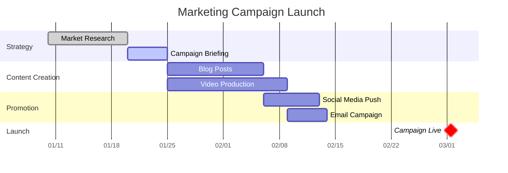

# Gantt Chart Generation

## Overview
A Gantt chart is a powerful project management tool that provides a visual representation of a project schedule over time. It is a type of bar chart that illustrates the start and finish dates of the terminal elements and summary elements of a project. This skill enables Manus to create, modify, and analyze Gantt charts programmatically, helping users to plan, coordinate, and track specific tasks in a project effectively. By leveraging this skill, users can define tasks, set durations, establish dependencies, and visualize the entire project timeline, making it an indispensable tool for project managers, team leads, and anyone involved in project planning and execution.

## Automatic Triggers

**ALWAYS activate this skill when user mentions:**
- Keywords: Gantt chart, cronograma, project plan, project schedule, task management, timeline, roadmap, gráfico de Gantt, planejamento de projeto, project timeline, task scheduling
- Phrases: "criar um gráfico de Gantt", "gerenciar meu cronograma de projeto", "visualizar o cronograma do projeto", "preciso de um roadmap do projeto"
- Context: Any discussion about creating, visualizing, or managing project timelines and task schedules.

**Example user queries that trigger this skill:**
- "Quero criar um cronograma para meu projeto de TCC"
- "Como posso visualizar as dependências das tarefas do meu projeto?"
- "Preciso de um gráfico de Gantt para a apresentação de resultados"

## When to Use This Skill
ALWAYS use this skill when user mentions: Gantt chart, cronograma, project plan, project schedule, task management, timeline, roadmap, gráfico de Gantt, planejamento de projeto. This skill is particularly useful in the following scenarios:

- **Project Planning:** When you need to create a detailed project schedule from scratch, outlining all tasks, their durations, and their start and end dates.
- **Task Scheduling:** To visualize the timeline of tasks and understand how they overlap and interconnect.
- **Dependency Management:** To define and visualize dependencies between tasks, ensuring that the project workflow is logical and achievable.
- **Progress Tracking:** To monitor the progress of a project by comparing the planned schedule with the actual progress.
- **Resource Allocation:** To get a clear overview of the project timeline, which helps in allocating resources effectively.
- **Stakeholder Communication:** To create clear and easy-to-understand visualizations of the project timeline for reporting to stakeholders.
- **Complex Project Management:** When dealing with large and complex projects with numerous tasks and interdependencies, a Gantt chart can simplify the complexity and provide a clear roadmap.

## Core Capabilities
This skill provides a range of capabilities to handle Gantt charts effectively:

### 1. Chart Generation from Task Lists
Manus can generate a Gantt chart from a simple, structured list of tasks. The user provides the task details, and the skill creates a visual chart.

**Input Format:**
A simple Markdown list or a JSON array of objects, where each object represents a task with properties like `id`, `name`, `start`, `finish`, and `dependencies`.

**Example Input (JSON):**
```json
[
  {
    "id": "task1",
    "name": "Requirement Analysis",
    "start": "2026-02-01",
    "finish": "2026-02-10"
  },
  {
    "id": "task2",
    "name": "Design",
    "start": "2026-02-11",
    "finish": "2026-02-20",
    "dependencies": "task1"
  }
]
```

### 2. Dependency Visualization
Clearly illustrates the relationships between tasks. The skill can draw arrows or lines connecting dependent tasks, showing which tasks must be completed before others can begin.

- **Finish-to-Start (FS):** The most common dependency type, where a task cannot start until a predecessor task is finished.
- **Start-to-Start (SS):** A task cannot start until a predecessor task has started.
- **Finish-to-Finish (FF):** A task cannot finish until a predecessor task has finished.
- **Start-to-Finish (SF):** A rare dependency where a task cannot finish until a predecessor task has started.

### 3. Milestone Integration
Allows the user to define and display key milestones in the project timeline. Milestones are represented as diamonds or other distinct markers on the chart, highlighting significant events or deadlines.

### 4. Progress Tracking
Users can update the progress of each task (e.g., as a percentage complete), and the skill will visually represent this progress on the taskbars. This provides an at-a-glance view of how the project is advancing compared to the plan.

### 5. Customization and Theming
The skill offers options to customize the appearance of the Gantt chart, including:

- **Color Schemes:** Apply different colors to taskbars based on task type, status, or assigned resource.
- **Date Formatting:** Customize the date format on the time axis (e.g., `YYYY-MM-DD`, `DD/MM/YYYY`).
- **Chart Dimensions:** Adjust the width and height of the generated chart image.

### 6. Exporting to Different Formats
Once a Gantt chart is created, it can be exported to various formats for sharing and documentation purposes:

- **PNG/JPEG:** For embedding in documents, presentations, or web pages.
- **SVG:** A scalable vector format that is ideal for high-resolution printing and web use.
- **PDF:** For easy sharing and archiving.

## Step-by-Step Workflow
Here is a typical workflow for using the Gantt Chart skill:

1.  **Initiate the Skill:** Start by asking Manus to create a Gantt chart. For example: `"Manus, create a Gantt chart for my new project."`

2.  **Provide Task Data:** Manus will prompt you for the project tasks. You can provide this information in a structured format like a Markdown list or JSON. For more complex projects, it's best to prepare a file (`.json`, `.csv`, or `.md`) with the task data.

    *User provides a file or pastes the data.*

    ```
    [Project Tasks]
    - Task A: Requirement Gathering (2026-03-01 to 2026-03-10)
    - Task B: UI/UX Design (2026-03-11 to 2026-03-25), depends on Task A
    - Task C: Frontend Development (2026-03-26 to 2026-04-30), depends on Task B
    - Milestone 1: Project Kick-off (2026-03-01)
    ```

3.  **Generate the Initial Chart:** Manus will process the data and generate the first version of the Gantt chart using a suitable library (e.g., Mermaid.js, Plotly, or Matplotlib). The chart will be displayed as an image.

4.  **Review and Refine:** Review the generated chart. You might want to make adjustments, such as changing colors, adding milestones, or updating task dependencies.

    *User command:* `"Change the color of 'Frontend Development' to blue and add a milestone for 'Alpha Release' on 2026-04-20."`

5.  **Update Progress:** As the project progresses, you can update the status of tasks. Provide the percentage of completion for each task.

    *User command:* `"Update task 'UI/UX Design' to 75% complete."`

    Manus will regenerate the chart with progress bars overlaid on the tasks.

6.  **Export the Final Chart:** Once you are satisfied with the Gantt chart, you can ask Manus to export it to your desired format.

    *User command:* `"Export the Gantt chart as a high-resolution PNG and a PDF document."`

## Best Practices
To get the most out of this skill, follow these best practices:

-   **Start with a Clear Task List:** Before generating a chart, ensure you have a well-defined list of tasks, including their estimated durations and dependencies. A work breakdown structure (WBS) can be very helpful.
-   **Keep it High-Level:** For very large projects, avoid cluttering the Gantt chart with too many granular sub-tasks. Group related tasks into summary tasks to keep the chart readable.
-   **Use Milestones:** Clearly mark important deadlines, deliverables, and project phases with milestones. This helps in tracking major achievements.
-   **Define Dependencies Logically:** Ensure that task dependencies reflect the actual workflow. Incorrect dependencies can lead to an unrealistic project schedule.
-   **Regularly Update Progress:** A Gantt chart is a living document. Keep it updated with the actual progress of tasks to ensure it remains a reliable tool for project tracking.
-   **Use a Consistent Format:** When providing task data, use a consistent date format and structure to avoid errors during chart generation.
-   **Leverage Customization:** Use color-coding and other visual cues to make the chart more informative. For example, you can use different colors for different teams, task priorities, or task statuses (e.g., on-track, delayed, completed).

## Examples

### Example 1: Simple Project Plan
**Scenario:** Planning a small office renovation.

**User Input (Markdown format):**
```markdown
- **Project: Office Renovation**
- **Tasks:**
  - **Planning & Budgeting:** 2026-02-05 to 2026-02-15
  - **Vendor Selection:** 2026-02-16 to 2026-02-25, depends on Planning & Budgeting
  - **Painting & Flooring:** 2026-03-01 to 2026-03-15, depends on Vendor Selection
  - **Furniture Assembly:** 2026-03-16 to 2026-03-20, depends on Painting & Flooring
  - **Final Touches & Cleaning:** 2026-03-21 to 2026-03-23
- **Milestones:**
  - **Budget Approved:** 2026-02-15
  - **Renovation Complete:** 2026-03-23
```
**Generated Output:** A PNG image of a Gantt chart visualizing the renovation timeline with tasks and milestones.

### Example 2: Software Development Sprint
**Scenario:** Visualizing a two-week agile sprint for a software development team.

**User Input (JSON format):**
```json
{
  "title": "Sprint 5 - Feature Development",
  "dateFormat": "YYYY-MM-DD",
  "tasks": [
    {
      "id": "BE1",
      "name": "Develop API Endpoints",
      "start": "2026-04-06",
      "finish": "2026-04-10",
      "owner": "Backend Team"
    },
    {
      "id": "FE1",
      "name": "Build UI Components",
      "start": "2026-04-08",
      "finish": "2026-04-14",
      "dependencies": "BE1",
      "owner": "Frontend Team"
    },
    {
      "id": "QA1",
      "name": "Integration Testing",
      "start": "2026-04-15",
      "finish": "2026-04-17",
      "dependencies": "FE1",
      "owner": "QA Team"
    }
  ],
  "milestones": [
    {
      "name": "Sprint Review",
      "date": "2026-04-17"
    }
  ]
}
```
**Generated Output:** An SVG image of the Gantt chart, with tasks colored by the assigned team.

### Example 3: Marketing Campaign Launch
**Scenario:** Planning a multi-channel marketing campaign.

**User Input (Mermaid.js Template):**

**Generated Output:** A PNG image generated from the Mermaid syntax, showing the different phases of the campaign.

## Templates for Programmatic Generation

### Python with Matplotlib
A Python script template for generating a Gantt chart using the `matplotlib` library. This is useful for more complex customizations and data analysis workflows.

```python
import matplotlib.pyplot as plt
import matplotlib.dates as mdates
from datetime import datetime

def create_gantt_chart(tasks):
    fig, ax = plt.subplots(figsize=(10, 5))

    for i, task in enumerate(tasks):
        start_date = datetime.strptime(task['start'], '%Y-%m-%d')
        end_date = datetime.strptime(task['finish'], '%Y-%m-%d')
        duration = (end_date - start_date).days
        ax.barh(i, duration, left=mdates.date2num(start_date), height=0.5, align='center', label=task['name'])

    ax.set_yticks(range(len(tasks)))
    ax.set_yticklabels([task['name'] for task in tasks])
    ax.invert_yaxis()

    ax.xaxis_date()
    ax.xaxis.set_major_formatter(mdates.DateFormatter('%Y-%m-%d'))
    fig.autofmt_xdate()

    plt.title('Project Gantt Chart')
    plt.xlabel('Date')
    plt.ylabel('Tasks')
    plt.grid(True)
    plt.show()

# Example Usage:
tasks = [
    {'name': 'Task 1', 'start': '2026-01-01', 'finish': '2026-01-10'},
    {'name': 'Task 2', 'start': '2026-01-05', 'finish': '2026-01-15'},
    {'name': 'Task 3', 'start': '2026-01-12', 'finish': '2026-01-20'}
]

create_gantt_chart(tasks)
```
