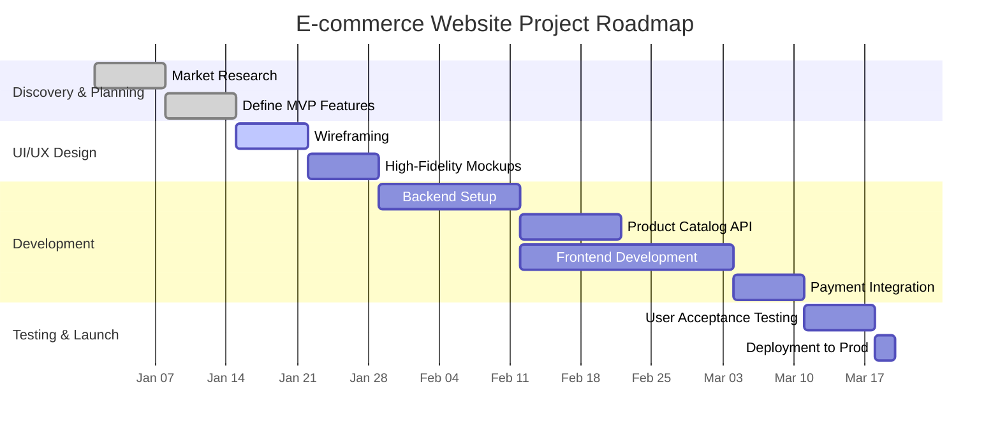
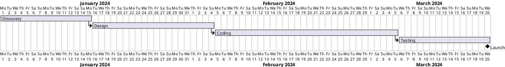

# Skill: Project Roadmap Creation

## Automatic Triggers

**ALWAYS activate this skill when user mentions:**
- Keywords: project roadmap, roadmap, project plan, timeline, Gantt chart, project schedule, cronograma, planejamento de projeto, criar roadmap, mapa do projeto, plano de projeto
- Phrases: "create a project roadmap", "build a timeline for my project", "how to plan a project", "preciso de um cronograma", "criar um roadmap de projeto", "planejar meu projeto"
- Context: Any discussion about planning, scheduling, or visualizing a project's lifecycle, from initiation to completion.

**Example user queries that trigger this skill:**
- "I need to create a project roadmap for my new software."
- "Can you help me build a Gantt chart for my marketing campaign?"
- "Quero planejar o lançamento de um produto e preciso de um cronograma."
- "Como posso visualizar as dependências do meu projeto?"

## Overview
This skill empowers Manus to create detailed, structured, and actionable project roadmaps. It leverages a combination of planning methodologies and tool-agnostic templates to generate roadmaps that are easy to understand, track, and maintain. A project roadmap is a high-level visual summary that maps out the vision, direction, priorities, and progress of a product or project over time. This skill is designed to take a user's project goals and break them down into a clear sequence of milestones, tasks, and dependencies, providing a clear path from conception to completion.

## When to Use This Skill

ALWAYS use this skill when the user mentions keywords related to project planning and visualization. This skill is ideal for creating, managing, and visualizing project roadmaps, timelines, and schedules.

**Use this skill for:**
- Creating detailed project roadmaps.
- Generating Gantt charts and timelines.
- Breaking down project goals into milestones and tasks.
- Mapping task dependencies.
- Visualizing project progress and schedules.

## Core Capabilities

### 1. Milestone and Task Definition
This skill can break down a high-level project goal into smaller, manageable milestones and tasks. It helps define what needs to be accomplished at each stage of the project.

- **Milestones:** Major achievements or turning points in the project (e.g., "Phase 1 Complete," "Beta Launch," "User Testing Finalized").
- **Tasks:** Specific actions required to achieve a milestone (e.g., "Design UI mockups," "Develop authentication feature," "Write API documentation").

### 2. Dependency Mapping
It identifies and visualizes dependencies between tasks, ensuring that the project flows logically and that prerequisites are met before subsequent tasks begin.

- **Finish-to-Start (FS):** The most common dependency type, where Task B cannot start until Task A is finished.
- **Start-to-Start (SS):** Task B cannot start until Task A has started.
- **Finish-to-Finish (FF):** Task B cannot finish until Task A is finished.
- **Start-to-Finish (SF):** Task B cannot finish until Task A has started.

### 3. Timeline Generation
Based on the defined tasks, dependencies, and estimated durations, the skill generates a project timeline. This can be represented in various formats, such as a Gantt chart or a simple timeline view.

- **Task Duration:** Estimates the time required to complete each task.
- **Start and End Dates:** Calculates the planned start and end dates for each task and milestone.

### 4. Roadmap Visualization
The skill can generate visual representations of the roadmap, making it easy to communicate the plan to others. This includes:

- **Gantt Charts:** A bar chart that illustrates the project schedule.
- **Timeline Diagrams:** A linear representation of project events and milestones.
- **Mermaid.js & PlantUML:** Generate diagrams from code for easy versioning and embedding.

### 5. Template-Based Creation
The skill includes several pre-built templates for different types of projects, which can be customized as needed.

- **Software Development Roadmap**
- **Marketing Campaign Roadmap**
- **Product Launch Roadmap**
- **Business Development Roadmap**

## Step-by-Step Workflow

1.  **Gather Project Requirements:** Manus will start by asking for key project information:
    *   Project Name and Goal
    *   Key Objectives and Deliverables
    *   Estimated Start and End Dates
    *   Main Stakeholders
    *   Known Constraints and Risks

2.  **Select a Roadmap Template:** Based on the project type, Manus will suggest a suitable template or allow the user to start from scratch.

3.  **Define Milestones and Tasks:** Manus will work with the user to break down the project into major milestones and the specific tasks required to achieve them. This is an iterative process.

    *   **User Input:** "My project is to launch a new mobile app. The main milestones are user research, development, beta testing, and public launch."
    *   **Manus Action:** The skill will create a structure with these milestones and prompt the user to detail the tasks for each.

4.  **Estimate Durations and Set Dependencies:** For each task, Manus will ask for an estimated duration (in days, weeks, or months). It will then help identify dependencies between tasks.

    *   **User Input:** "The 'Develop Login Feature' task will take 2 weeks. The 'Test Login Feature' task can only start after the development is complete."
    *   **Manus Action:** The skill will record the duration and set a Finish-to-Start dependency.

5.  **Generate the Roadmap:** Once all tasks, durations, and dependencies are defined, Manus will generate the complete project roadmap. This will include:
    *   A detailed task list with start/end dates.
    *   A visual representation (e.g., a Gantt chart in Mermaid.js syntax).
    *   A summary of key milestones.

6.  **Review and Refine:** Manus will present the generated roadmap to the user for review. The user can request changes, such as adjusting timelines, adding tasks, or modifying dependencies. The skill will update the roadmap accordingly.

7.  **Export the Roadmap:** The final roadmap can be exported in various formats:
    *   Markdown (`.md`)
    *   PNG image (from generated diagrams)
    *   PDF document

## Best Practices

- **Be Specific but Flexible:** Define clear milestones and tasks, but be prepared to adapt the roadmap as the project evolves. A roadmap is a guide, not a rigid plan set in stone.
- **Focus on Outcomes, Not Just Outputs:** Milestones should represent meaningful achievements and value delivery, not just the completion of a set of tasks.
- **Keep it High-Level:** The main roadmap should provide a strategic overview. Detailed task management can be handled in other tools (like Jira, Asana, or Trello). This skill focuses on the big picture.
- **Involve Stakeholders:** Collaborate with key stakeholders when creating the roadmap to ensure alignment and buy-in.
- **Regularly Review and Update:** A project roadmap is a living document. Review it regularly (e.g., weekly or bi-weekly) to reflect the current status and any changes in priorities.
- **Use Visuals:** Visual roadmaps are more engaging and easier to understand than text-only plans. Leverage the skill's diagramming capabilities.

## Examples

### Example 1: Simple Software Development Project

**User Prompt:** "Create a project roadmap for developing a new e-commerce website. The project should take about 3 months. Key phases are Discovery, Design, Development, and Launch."

**Generated Roadmap (Markdown & Mermaid.js):**

```markdown
# Project Roadmap: E-commerce Website Launch

## Milestones

*   **M1: Discovery & Planning (Weeks 1-2)**
*   **M2: UI/UX Design (Weeks 3-4)**
*   **M3: Backend & Frontend Development (Weeks 5-10)**
*   **M4: Testing & QA (Weeks 11-12)**
*   **M5: Launch (Week 12)**

## Gantt Chart



### Example 2: Marketing Campaign Roadmap Template

This is a ready-to-use template that the skill can provide.

```markdown
# Marketing Campaign Roadmap: [Campaign Name]

## Phase 1: Strategy & Planning
- **[Task]** Define Campaign Goals & KPIs
- **[Task]** Identify Target Audience
- **[Task]** Budget Allocation
- **[Task]** Channel Strategy

## Phase 2: Content & Creative Development
- **[Task]** Develop Key Messaging
- **[Task]** Create Ad Copy & Visuals
- **[Task]** Produce Video Content
- **[Task]** Design Landing Pages

## Phase 3: Campaign Execution
- **[Task]** Launch Social Media Ads
- **[Task]** Start Email Marketing Sequence
- **[Task]** Publish Blog Posts
- **[Task]** Run PPC Campaigns

## Phase 4: Analysis & Reporting
- **[Task]** Monitor Campaign Performance
- **[Task]** A/B Test Analysis
- **[Task]** Weekly Performance Report
- **[Task]** Final Campaign ROI Report
```

### Example 3: PlantUML Gantt Chart Template

For users who prefer PlantUML, the skill can generate the following syntax.



## References

1.  **Atlassian: How to build a product roadmap** - [https://www.atlassian.com/product-management/product-roadmap](https://www.atlassian.com/product-management/product-roadmap)
2.  **Aha! Roadmaps: The complete guide to product roadmaps** - [https://www.aha.io/roadmapping/guide/product-roadmap](https://www.aha.io/roadmapping/guide/product-roadmap)
3.  **Mermaid.js Documentation** - [https://mermaid-js.github.io/mermaid/](https://mermaid-js.github.io/mermaid/)
4.  **PlantUML Gantt Chart Documentation** - [https://plantuml.com/gantt-diagram](https://plantuml.com/gantt-diagram)

